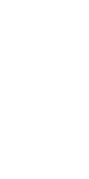

# typesheet

typesheet is a tiny Python script for creating transparent PNG spritesheets from TrueType (.ttf) fonts.

I made it because I couldn't find an easy option online while developing a game.

I welcome contributions, but I don't plan to spend more than a few minutes a month maintaining this repo.



an example image. switch to dark mode if you can't see it.

## How to use

### 1. Install
`pip install pillow tcod numpy PIL`

There might be more dependencies missing. If so, you should install them the same way.  I'll accept PRs to update the list of deps, but I rarely write Python and can't be bothered to set up a clean-room environment to figure them out myself.

### 2. Use
See the usage string:
```
$ ./make_tileset.py -h
$ python3 make_tileset.py -h                                                                                                                                                                                                                                                                                        126 ↵
usage: make_tileset.py [-h] input_file width_px height_px output_file

positional arguments:
  input_file   a truetype (.ttf) font file
  width_px     width of a glpyh('s bounding box) in px
  height_px    height of a glyph('s bounding box) in px
  output_file  the path to write the output file

optional arguments:
  -h, --help   show this help message and exit
```

Exact command used to generate the example image:
```
python make_tileset.py Px437_IBM_Model3x_Alt3.ttf 8 16 ibm_model3x_8x16.png
```
Font file was found at https://int10h.org/oldschool-pc-fonts

## Also

This code is released under whatever licenses are appropriate given the dependencies.
I claim no ownership etc. and you can use it for whatever you want. I don't care.
